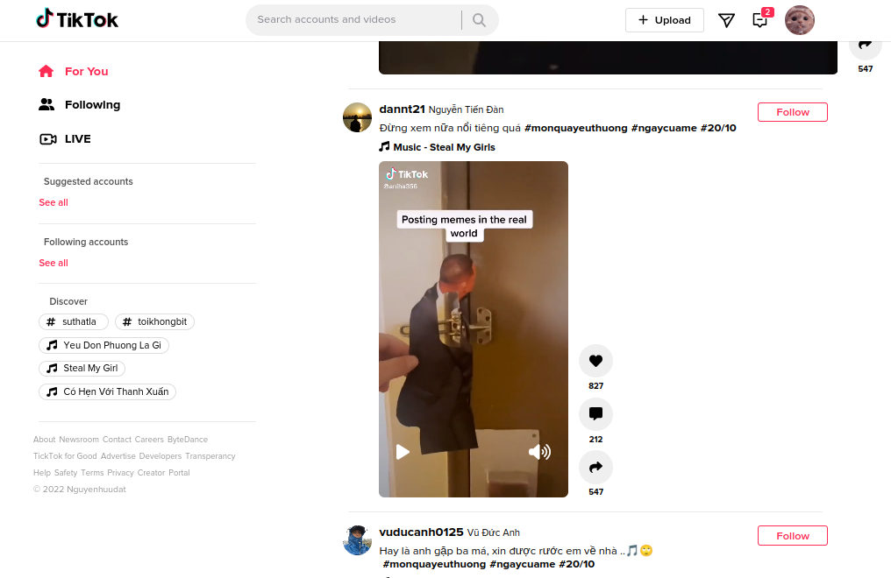

# TikTok Clone

  

  

### 29/9/2022

-  memo: là HOC (higher Order Component) Use to memoized (ghi nhớ) value, the component only re-render when one of its props update, avoid re-render compt while don't change its props/ unnecessary;
   Syntax: export default memo(component)

-  UseCallback: Use to memoizied callback function, this only run when one of its deps update

-  Dùng useCallback kết hợp với useMemo: Truyền hàm cho component dưới dạng prop thì dùng useCallback lúc đó có tác dụng luôn ghi nhớ giá trị của callback function truyền vào + useMemo giúp cho componet không bị re-render lại vì lúc này prop không thay đôi

-  useImperativeHandle: dùng để export method của element do mình định nghĩa ra ngoài, thay vì export tất cả methob của element đó
   forwardRef: dùng để truyền ref từ component cha cho component con,

### update thứ 5 30/10/2023

-  sửa config isUser = true
-  Thêm chức năng like

### update chủ nhật 4/6/2023

-  Thêm biến môi trường phải restart server

### update thứ 3 6/6 2023

-  Infinity scroll bằng interSectionObserve

### update thứ 6 9/6/2023

-  Chinh css để tua video, chỉnh âm lượng dẽ hơn

### update thứ 7 10/6/2023

-  Đưa các hàm xử lí qua PlayerItem, để cho video không bị render lại nhiều lần
-  Sửa css PlayerItem
-  Thêm skeleton loading
-  Issue lỗi skeleton loading khi load thêm video
